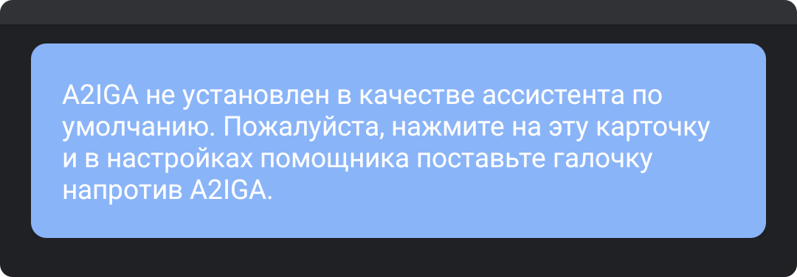
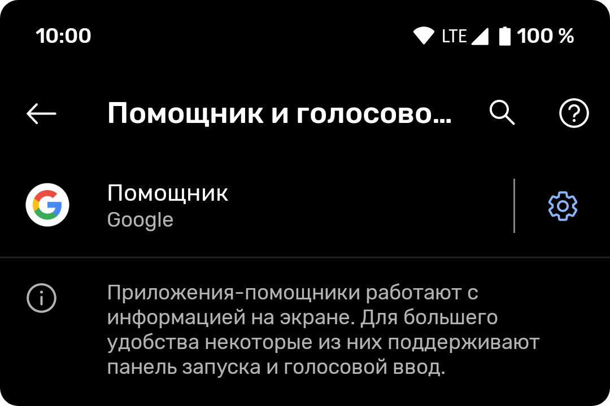
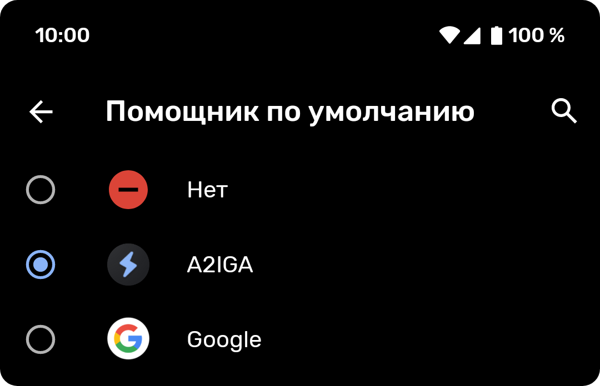
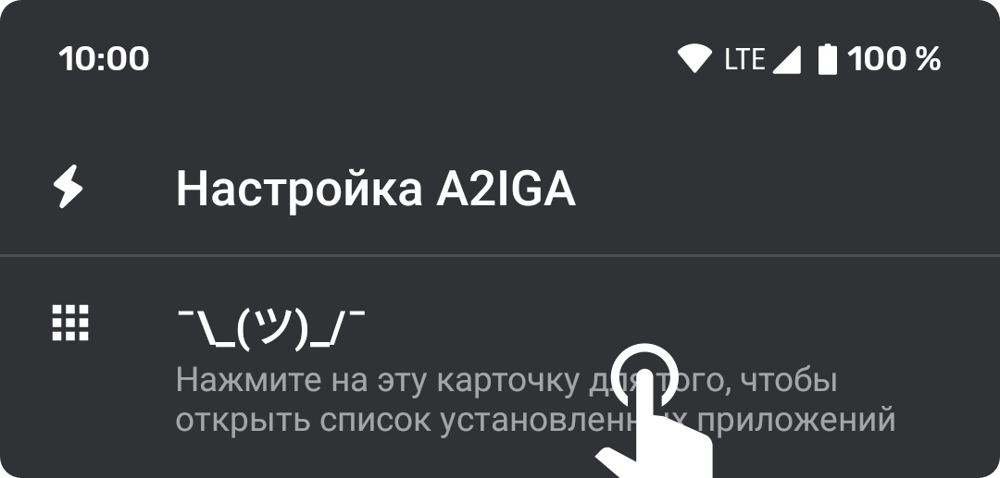
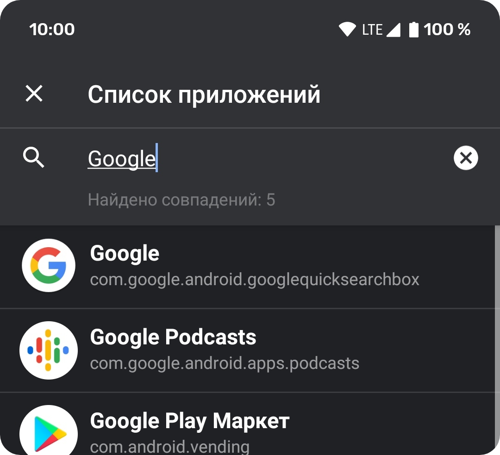
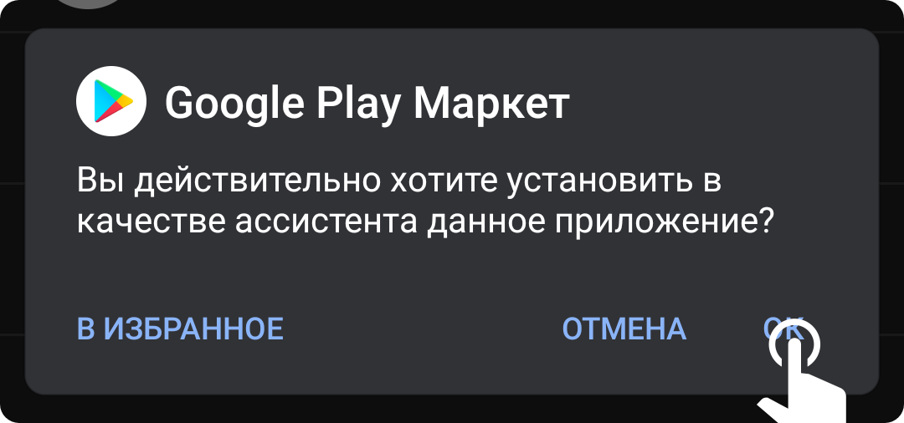
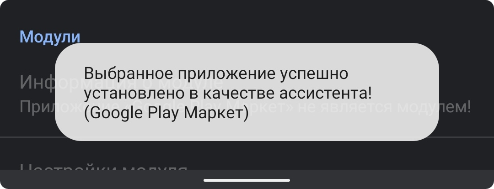
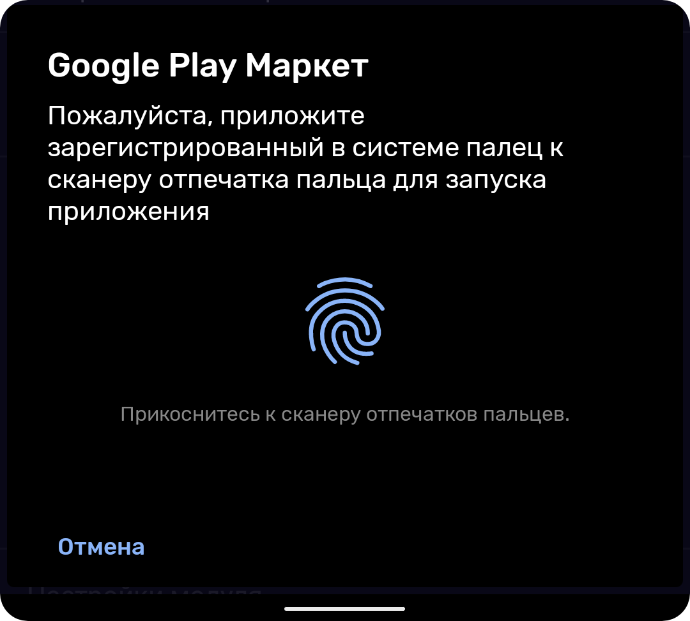
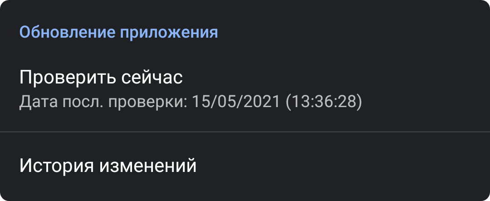

# :zap: A2IGA – Any App Instead Google Assistant


[](https://github.com/a2iga/a2iga/releases)
[](https://github.com/a2iga/a2iga/blob/master/LICENSE)


[](https://github.com/rx1310/a2iga/commits/master)
[](https://github.com/a2iga/a2iga/graphs/contributors/)
[](https://github.com/a2iga/a2iga/discussions)

Маленькая утилита, которая поможет заменить Google Assistant, вызываемый зажатием кнопки Home / жестом нижних краёв экрана (Android Q), на любое приложение, нужное вам.

## Загрузка и установка
Скачать самую последнюю версию A2IGA всегда можно на [странице релизов](https://github.com/a2iga/a2iga/releases/latest) этого репозитория.

После загрузки APK-файла необходимо установить его и запустить. После запуска потребуется всего пару действий от пользователя для того, чтобы A2IGA функционировал как надо.

> **Обратите внимание!** A2IGA работает только на устройствах с версией Android 6.0 и выше!

1. После запуска A2IGA на экране приложения должна быть карточка, в которой написано, что A2IGA не является ассистентом:


2. Требуется лишь нажать на карточку, после чего должно открыться системное окно настроек "Помощник и голосовой ввод", в котором будет пункт "Помощник":


3. Нажмите на этот пункт и в окне, которое откроется после нажатия на пункт, поставьте галочку/кружок рядом с A2IGA:


4. Всё! A2IGA готов к работе.

### Выбор приложения для запуска
В A2IGA есть окно со списком приложений, установленных на устройстве - AppsList.



Используя AppsList можно искать приложения (есть поиск) и устанавливать их в качестве ассистента.



Найдя нужное Вам приложение просто нажмите на него, после в диалоговом окне согласитесь на установку выбранного вами приложения в A2IGA, как на скриншоте ниже:



После согласия окно AppsList закроется и снизу экрана Вы должны увидеть сообщение об успешной установке:



**Готово!** Можете вызвать ассистент долгим нажатием на кнопке Home (кружок в AOSP, закругл. квадрат в MIUI, etc.) и увидеть результат. На этом первоначальная настройка A2IGA завершена.

> Вы можете в любой момент поменять приложение, которое будет запускаться при вызове ассистента, в любой момент. Используйте AppsList.

## Прочие настройки A2IGA
В A2IGA есть некоторые настройки, которые могут Вам пригодиться.

### Биометрическая аутентификация
Вы можете включить запрос отпечатка пальца при запуске ассистента! Для этого необходимо чтобы устройство имело сканер отпечатка пальца, иначе функция будет недоступна. Если сканер у Вас есть, то в настройках A2IGA просто включите настройку "Запуск по отпечатку пальца" и всё. След. раз при запуске ассистента будет отображено окно, в котором Вас попросят приложить палец к сканеру отпечатка пальца для запуска приложения.



> Внешний вид окна зависит от системы!

### Настройки AppsList
AppsList является основной частью приложения, ибо вокруг него и строится весь функционал. Его можно худо-бедно настроить.

- **Иконки приложений –** Если у Вас наблюдаются подлагивания списка AppsList, то отключение загрузки иконок прриложения значительно снизят нагрузку и список будет пролистываться без проблем.
- **Имя пакета –** Помимо AppsList, в A2IGA есть возможность указать package name приложения, которое будет запускаться при вызове ассистента (нажмите на иконку молнии на главном экране). По умолчанию имена пакетов отображаются в AppsList и их можно скопировать длительным нажатием на пункт с приложением.
- **Расширенный список –** В AppsList отображаются только те приложения, которые есть у Вас в меню приложений на рабочем столе, но включив эту настройку Вы можете отобразить практически все приложения, которые есть у Вас на устройстве.

## Обновление A2IGA
У приложения нет конкретного и регулярного графика выхода обновлений. Когда будет готово - тогда и будет выпущено. Следить за обновлениями можно в Telegram-канале разработчика - [@rx1310_dev](https://t.me/rx1310_dev) (ссылка кликабельна).

Также в приложении есть механизм проверки наличия новой версии. На главном окне A2IGA есть раздел "Обновление приложения" и пункт "Проверить сейчас".



При наличии интернет-соединения после нажатия произойдет сравнивание номера версии на вашем устройстве и номера версии из [ota.json](https://github.com/a2iga/a2iga/blob/master/ota.json) в репозитории. Если в ota.json версия выше, то Вам отобразят окно с уведомлением об обновлении (+ там же будет кнопка "Скачать").

## Локализация
На данный момент в A2IGA только русская локализация (разработчик не владеет достойно английским, а машинный перевод фэ) и было бы приятно, если бы вы помогли с локализацией приложения на другие языки. 

## Лицензия
A2IGA является свободным продуктом, который также свободно и бесплатно распространяется в сети Интернет. Исходный код проекта открыт и доступен для всех желающих по лицензии MIT.
```
MIT License

Copyright (c) 2021 Haba Kudzaev (@rx1310)

Permission is hereby granted, free of charge, to any person obtaining a copy
of this software and associated documentation files (the "Software"), to deal
in the Software without restriction, including without limitation the rights
to use, copy, modify, merge, publish, distribute, sublicense, and/or sell
copies of the Software, and to permit persons to whom the Software is
furnished to do so, subject to the following conditions:

The above copyright notice and this permission notice shall be included in all
copies or substantial portions of the Software.

THE SOFTWARE IS PROVIDED "AS IS", WITHOUT WARRANTY OF ANY KIND, EXPRESS OR
IMPLIED, INCLUDING BUT NOT LIMITED TO THE WARRANTIES OF MERCHANTABILITY,
FITNESS FOR A PARTICULAR PURPOSE AND NONINFRINGEMENT. IN NO EVENT SHALL THE
AUTHORS OR COPYRIGHT HOLDERS BE LIABLE FOR ANY CLAIM, DAMAGES OR OTHER
LIABILITY, WHETHER IN AN ACTION OF CONTRACT, TORT OR OTHERWISE, ARISING FROM,
OUT OF OR IN CONNECTION WITH THE SOFTWARE OR THE USE OR OTHER DEALINGS IN THE
SOFTWARE.
```
---


