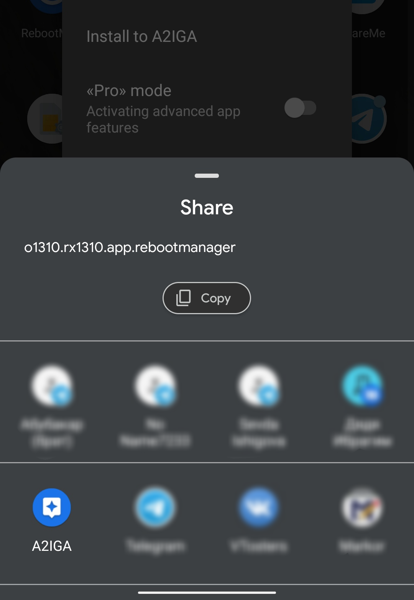
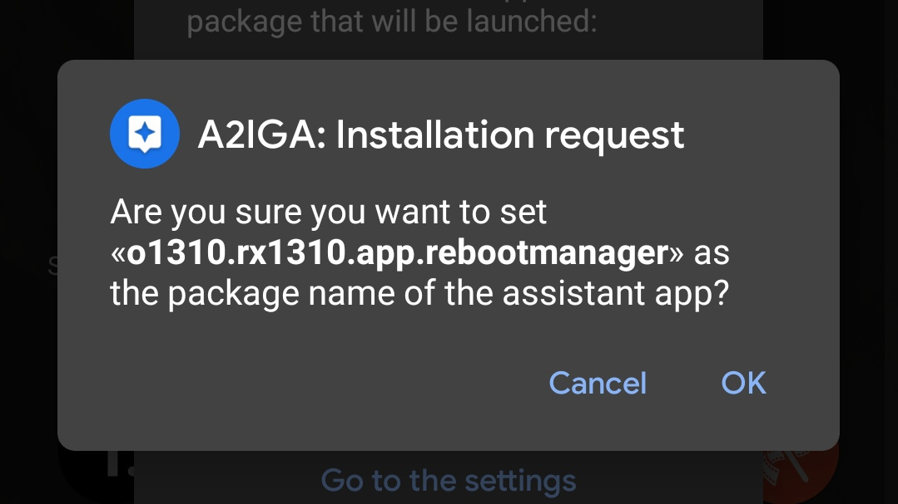
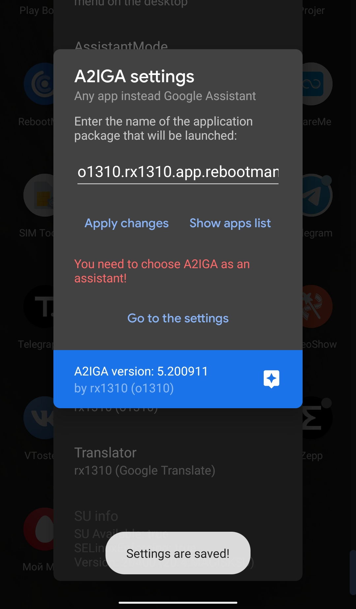

## GottenPackageName — установка приложения-ассистента напрямую
**Начиная с версии 5, в A2IGA можно установить приложение-ассистент не входя в само приложение!**

Теперь разработчики приложений могут выполнить установку в A2IGA своего приложения в качестве ассистента.

Необходимо отправить Intent A2IGA с package name с помощью кода ниже:
```
Intent sendPackageName = new Intent();
sendPackageName.setAction(Intent.ACTION_SEND);
sendPackageName.putExtra(Intent.EXTRA_TEXT, "com.android.settings"); *// "com.android.settings" - имя пакета, которое принимает A2IGA*
sendPackageName.setType("text/plain");
startActivity(Intent.createChooser(sendPackageName, "Select «A2IGA»!"));
```
### Пример работы
- 
- 
- 
