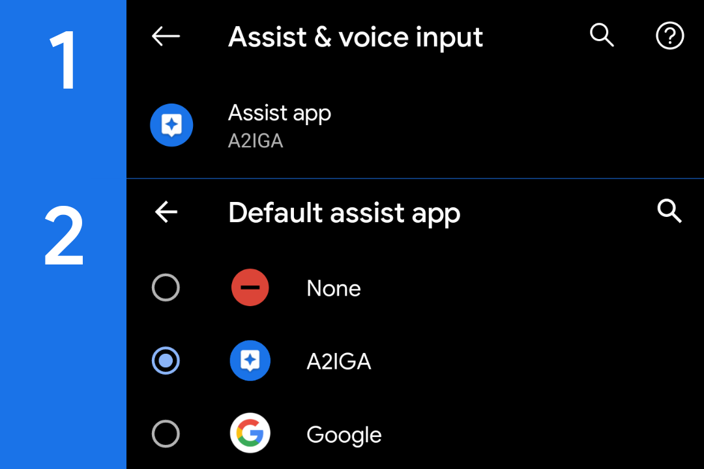

## Первоначальная настройка A2IGA

Сама по себе настройка A2IGA очень (ну очень) проста. Дело одной минуты, т.с. Однако, я всё-таки должен написать инструкцию о том, как нужно настроить A2IGA, чтобы начать им пользоваться.

Приступим.

### Настройка A2IGA 4 (и новее)
1. Устанавливаем A2IGA из [релизов](https://github.com/rx1310/a2iga/releases) на GitHub;
2. Нажимаем на кнопку **Список приложений**;
3. Выбираем нужное нам приложение тапом и в диалоге выбираем действие **Установить в качестве ассистента**;
> Вы также можете вручную вписать в поле ввода имя пакета приложения, которое будет запускаться при вызове ассистента.
5. Закрываем окно со списком приложений и жмём на кнопку **Перейти к настройкам ассистента**;
6. В пункте **Помощник по умолчанию** выбираем A2IGA (см. изображение ниже);

6. Выполните жест с нижнего края экрана (для Android 10) или зажмите кнопку **Home**;
7. Все!

### Настройка A2IGA 3
1. Установите и запустите A2IGA;
2. Введите имя пакета в поле ввода;
> Если Вы не знаете имя пакета нужного приложения, то просто нажмите на кнопку **Показать список** и в открывшемся окне просто нажмите на нужное приложение из списка, чтобы скопировать package name.
3. Нажмите на кнопку **Применить**;
4. Увидев toast-сообщение о том, что изменения применены, нажмите на кнопку **Перейти в настройки** и в пункте **Помощник по умолчанию** выберите A2IGA;

6. Выполните жест с нижнего края экрана (для Android 10) или зажмите кнопку **Home**;
7. Все!
